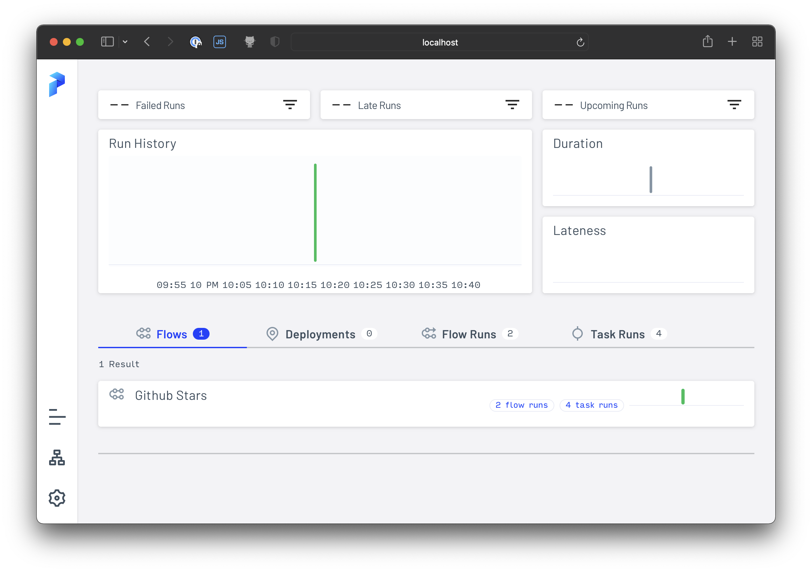

<figure markdown=1>
{: width=500px style="padding-top: 50px; padding-bottom: 50px;"}
</figure>

#

## Welcome!

Prefect Orion is the second-generation workflow orchestration engine from [Prefect](https://www.prefect.io), now available as a [technical preview](faq/#why-is-orion-a-technical-preview).

Orion was designed from the ground up to handle the dynamic, scalable workloads that the modern data stack demands. Powered by a brand-new, async rules engine, it represents an enormous amount of research, development, and dedication to a simple idea:

_**You should love your workflows again.**_

Read the docs, run the code, or host the UI. Join thousands of community members in [Slack](https://www.prefect.io/slack) to share your thoughts and feedback. Thanks for being part of the mission to build a new kind of workflow system and, of course, **happy engineering!**

!!! info "Don't Panic"
    Prefect Orion is under active development and may change rapidly. For production use, please prefer [Prefect Core](https://github.com/prefecthq/prefect).

## Hello, Orion!

Prefect is the easiest way to transform any function into a unit of work that can be observed and governed by orchestration rules. 

Add workflow features like retries, distributed execution, scheduling, caching, and much more, with minimal changes to your code. Every activity is tracked and becomes visible in the Orion UI.

=== "Basic orchestration"

    Decorate functions to automatically retry them on failure while providing complete visibility in the Orion Dashboard.


    ```python hl_lines="1 6 13"
    from prefect import flow, task
    from typing import List
    import httpx


    @task(retries=3)
    def get_stars(repo: str):
        url = f"https://api.github.com/repos/{repo}"
        count = httpx.get(url).json()["stargazers_count"]
        print(f"{repo} has {count} stars!")


    @flow(name="Github Stars")
    def github_stars(repos: List[str]):
        for repo in repos:
            get_stars(repo)


    # run the flow!
    github_stars(["PrefectHQ/Prefect", "PrefectHQ/miter-design"])
    ```

=== "Parallel execution"

    Control task execution by changing a flow's `executor`. The tasks in this flow will automatically be submitted to run in parallel on a [Dask](https://dask.org) distributed cluster.

    ```python hl_lines="2 14"
    from prefect import flow, task
    from prefect.executors import DaskExecutor
    from typing import List
    import httpx


    @task(retries=3)
    def get_stars(repo: str):
        url = f"https://api.github.com/repos/{repo}"
        count = httpx.get(url).json()["stargazers_count"]
        print(f"{repo} has {count} stars!")


    @flow(name="Github Stars", executor=DaskExecutor())
    def github_stars(repos: List[str]):
        for repo in repos:
            get_stars(repo)


    # run the flow!
    if __name__ == "__main__":
        github_stars(["PrefectHQ/Prefect", "PrefectHQ/miter-design"])
    ```

    !!! warning "Guarding \__main__"
        When using Python multiprocessing (as Dask does), best practice is to guard global-scope calls with `if __name__ == "__main__":`. This avoids an infinite recursion if you run the code as a standalone script (with certain process start methods). If you run the code interactively, you don't need the guard.

=== "Async concurrency"

    With native async support, concurrent parallelism is easy. Asynchronous flows can include a mix of synchronous and asynchronous tasks, just like Python.

    ```python hl_lines="4 8-10 16-17 21"
    from prefect import flow, task
    from typing import List
    import httpx
    import asyncio


    @task(retries=3)
    async def get_stars(repo: str):
        async with httpx.AsyncClient() as client:
            response = await client.get(f"https://api.github.com/repos/{repo}")
        count = response.json()["stargazers_count"]
        print(f"{repo} has {count} stars!")


    @flow(name="Github Stars")
    async def github_stars(repos: List[str]):
        await asyncio.gather(*[get_stars(repo) for repo in repos])


    # run the flow!
    asyncio.run(github_stars(["PrefectHQ/Prefect", "PrefectHQ/miter-design"]))
    ```

After running any of these flows, fire up the UI to gain insight into their execution.

<figure markdown=1>
{: max-width=600px}
</figure>

From here, you can continue to use Prefect interactively or set up automated [deployments](concepts/deployments.md).

## Next steps

Orion was designed to be incrementally adopted into your workflows, and our documentation is organized to support your exploration as much as possible. It is organized into four main sections whose applicability will depend on your objectives and comfort level.

### Getting started

Begin by [installing Orion](getting-started/installation.md) on your machine, then follow one of our [friendly tutorials](tutorials/first-steps) to learn by example. See the [Getting Started overview](getting-started/overview) for more.

### Concepts

Learn more about Orion's features and design by reading our in-depth [concept docs](concepts/overview.md). These are intended to introduce the building blocks of Orion, build up to orchestration and deployment, and finally cover some of the advanced use cases that Orion makes possible.

### Frequently asked questions

Orion represents a fundamentally new way of building and orchestrating data workflows. Learn more about the project by reading our [FAQ](faq.md).

### API reference

Orion provides a number of programmatic workflow interfaces, each of which is documented in the [API Reference](api-ref/overview). This is where you can learn how a specific function works, or see the expected payload for a REST endpoint.

## Join the community

Orion was made possible by the fastest-growing community of data engineers. The [Prefect Slack community](https://prefect.io/slack) is a fantastic place to learn more, ask questions, or get help with workflow design. Join us and thousands of friendly data engineers to help build a new kind of workflow system.
